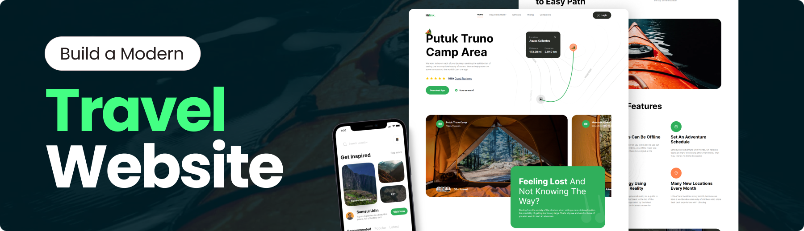

 An ultimate camp traveler app built with Next.js 14 and Tailwind CSS. Experience a seamless, feature-packed travel solution designed with a sleek, modern UI and optimized for mobile-first usability.

This is a [Next.js](https://nextjs.org/) project bootstrapped with [`create-next-app`](https://github.com/vercel/next.js/tree/canary/packages/create-next-app).

The website is deployed and accessible at https://hilink-ui.netlify.app/.


# ⚙️  Tech Stack 
- Next.js
- Tailwind CSS
- Typescript

# 👉 Features

- <b>Appealing Hero Section</b>: Visually striking hero section that captures attention and sets the tone for the website

- <b>Camp Exploration Section</b>: Showcase various camps in a dedicated section, allowing users to explore different options.

- <b>Engaging Travel Guide Section</b>: A compelling travel guide section with informative content and captivating visuals.

- <b>Feature-Rich Section</b>: A complex and feature-rich section offering advanced functionalities or in-depth information.

- <b>Call to Action for Mobile Apps</b>: A call-to-action section encouraging users to explore the mobile app version, complete with download links.

- <b>Footer</b>: Comprehensive footer section containing site and social media links for easy navigation and connectivity.

# 🤸  Getting Started

Follow these steps to set up the project locally on your machine.

### Prerequisites

Make sure you have the following installed on your machine:

- Git
- Node.js
- npm (Node Package Manager)

### Cloning the Repository
```bash
git clone git@github.com:miadinh38/travel-app.git
cd travel_app
```

### Installation

Install the project dependencies using npm:
```bash
npm install
```
### Running the Project
```bash
npm run dev
```
Open http://localhost:3000 in your browser to view the project.